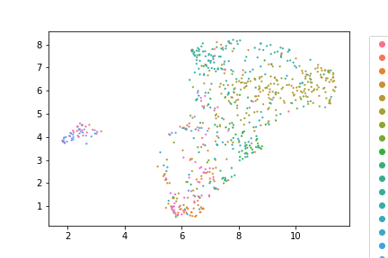
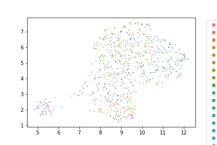

# Vignette for using a matrix prior with latent Dirichlet allocation

In this vignette, we describe how to generate and apply a matrix prior for latent Dirichlet allocation, as reported in the paper: 

`Alan Min, Timothy J Durham, Louis Gevirtzman, and William S Noble. Matrix prior for data transfer between single cell data types in latent dirichlet allocation. bioRxiv, pages 2022–11, 2022.`

We adapt some of the documentation originally from Louis Gevirtzman. The prior aims to incorporate information from a large reference dataset into the analysis of a target dataset. We start with installation of the code, which is packaged in Java and available as a command line tool. We then describe how to apply the method to a small example data set, modified from Ma *et al*, 2020. Finally, we visualize the results.

## Installation

The code for the matrix prior is available at https://github.com/gevirl/LDA. 

This program is a java application that can be run using the dist.zip file distribution. This zip file includes the jar file and required libraries. 

1. Clone the GitHub repository

2. Unzip the file `LDA-master.zip`

3. Unzip the distribution file `dist.zip`

4. The program can be used by running the jar file  `dist/LatentDirichletAllocation.jar` (note that your file path may be slightly different, so you will have to locate this file and use it).

The main entry point to the jar file is the class: `org.rhwlab.lda.cache.matrix.LDA_CommandLine`.
After unzipping the dist.zip file, the program can be run with:

`java -jar  “your_directory”/dist/LatentDirichletAllocation.jar [entry point] [options]`

## Using the package on a simple example

The example data are available in the `data` folder in the github page. The reference and target data are both samples from this dataset, although in practice you may want to use data from different sources. These files include downsampled versions of the Ma *et al* 2020 data. There is a medium-sized example data set and a small-sized example data set available. In the medium data, the reference dataset has 1000 cells and the target data set has 100 cells, each with 20,000 genes. We use the medium data for our examples, but the small data set can be used for quicker results. The data is stored in a sparse matrix format, called a `.bow` file, which stands for "bag of words." The first line of each bow file is the number of cells in the data set (number of rows in the matrix). The second line is the number of genes / peak regions (number of columns in the matrix). The third line is a line that is not used by the Java program, and can be set to any number.


1. Start by running the LDA algorithm on the reference data using a uniform prior, as follows:

    `java -cp LDA-master/dist/LatentDirichletAllocation.jar org.rhwlab.lda.cache.matrix.LDA_CommandLine -ib data/atac_reference.bow -out uniform_ref -t 15 -v 1 -lda -maxLike -alpha 3 -beta 800 -ldaIterations 1000 -seed 123`
    
    This command takes in the `reference.bow` file and applies LDA to it. It puts the output into a folder called uniform_ref (`-out` option), uses 15 topics (`-t` option), gives verbosity level at 1 (`-v` option), runs LDA (`-LDA` option), uses the maximum likelihood option (`-maxLike` option), sets $c_\alpha$ to be 3 (`-alpha` option), sets the $c_\beta$ parameter to be 800 (`-beta` option), sets the number of iterations to be 1000 (`-ldaIterations` option), and sets a seed (`-seed` option).

2. Create a prior using the result of the LDA on the reference data. We can use the file make_priors.py to read in the the output, add a small pseudocount to avoid 0 counts, normalize each row to sum to 1 (the required format for the matrix prior), and create a file in a format compatible with the matrix prior functionality of the package. We use the command 

    `python src/make_priors.py uniform_ref/atac_reference_topics15_alpha3.000_beta800.000/MaxLikelihoodWordTopicCounts.txt prior.txt 15`
    
    The results are stored in an output file called `prior.txt` that contains the prior in a format that can be input into the Java program on the command line.

3. Use the matrix prior method to analyze the target data, as follows:

    `java -cp LDA-master/dist/LatentDirichletAllocation.jar org.rhwlab.lda.cache.matrix.LDA_CommandLine -ib data/atac_target.bow -out output -t 15 -v 1 -lda -maxLike -alpha 3 -betaFile prior.txt -beta 1000 -ldaIterations 1000 -seed 123`

4. Run the LDA algorithm on the target data using a uniform prior. This will allow us to compare the results with when a reference matrix prior is used. We use the following command

    `java -cp LDA-master/dist/LatentDirichletAllocation.jar org.rhwlab.lda.cache.matrix.LDA_CommandLine -ib data/atac_target.bow -out uniform_target -t 15 -v 1 -lda -maxLike -alpha 3 -beta 800 -ldaIterations 1000 -seed 123`

## Visualizing the results in Python

We can now use Python to visualize the results from the simple analysis. We will be using UMAP, a dimensionality reduction tool (McInnes *et al*, 2018) to reduce the output from the 15 topic dimensions to 2 dimensions for visualization.

We use the following versions of packages:

`UMAP Version: 0.5.1
Numpy Version: 1.19.1
Matplotlib.pyplot Version: 3.4.2)
Seaborn: 0.11.1`

```python
import umap
import numpy as np
import matplotlib.pyplot as plt
import seaborn as sns
from src.lda import *

def load_dt(fn) :
    dt = np.loadtxt(open(fn, "r"), delimiter=",")
    normalize_matrix_by_row(dt)
    return(dt)

dt = load_dt(f"output/atac_target_topics15_alpha3.000_beta1000.000/MaxLikelihoodDocumentTopicCounts.txt")
labels = pd.read_csv("target_labels_large.csv", header=None).to_numpy().flatten()
u = umap.UMAP(random_state=23)
fitted = u.fit_transform(dt)
sns.scatterplot(x=fitted[:, 0], s=4, y=fitted[:, 1], hue=labels, edgecolor=None)
plt.legend(bbox_to_anchor=(1.05, 1))
```

This results in a UMAP image of the target data using the matrix prior.




We can make a similar plot using the uniform prior, as follows:

```python
dt = load_dt(f"uniform_target/atac_target_topics15_alpha3.000_beta800.000/MaxLikelihoodDocumentTopicCounts.txt")
labels = pd.read_csv("target_labels_large.csv", header=None).to_numpy().flatten()
u = umap.UMAP(random_state=23)
fitted = u.fit_transform(dt)
sns.scatterplot(x=fitted[:, 0], s=4, y=fitted[:, 1], hue=labels, edgecolor=None)
plt.legend(bbox_to_anchor=(1.05, 1))
```



## Other options in the package

These are the options that are also listed on the LDA GitHub repository at https://github.com/gevirl/LDA. The various options will be listed if the jar file is run with -h or -help

`java -jar LatentDirichletAllocation.jar -h`

Description - Latent Dirichlet Allocation (binary iteration output)

_General Options:_

    -r, -rid (string) 
		user supplied run identification, default based on bow file, topics, alpha, and beta
        
	-s, -seed (long integer)
		random number generator seed, default=1000
        
	-th, -threads (integer)
		number of threads to use for LDA and Chib, default=1

_Processing Directives:_

	-lda  
		lda iterations
        
	-pe  
		point estimate from lda iterations
        
	-chib  
		chib estimation
        
	-part  
		partition validation, partitions BOW file and writes commands to stdout

_LDA Options:_

	-a, -alpha (float)
		Dirichlet concentration parameter for document distribution, default=0.1
        
	-af, -alphaFile (path)
		file of vector base measure priors for document distributions, no default
        
	-b, -beta (float)
		Dirichlet concentration parameter for topic distribution, default=0.1
        
	-bf, -betaFile (path)
		file of vector base measure priors for topic distributions, no default
        
	-binarize,  binarize the input word counts, default = false
    
	-ch, -cache (integer)
		Output cache size, if cache size = 0 then compute point estimates during lda, default=10
        
	-ib, -inputBOW (path)
		input bag of words file, no default
        
	-im, -inputMM (path)
		input matrix market file, no default
        
	-li, -ldaIterations (integer)
		numer of lda iterations, default=1000
        
	-maxLike  
		report the iteration with the maximum likelihood
        
	-o, -out (path)
		main output directory for LDA iterations, no default
        
	-t, -topic (integer)
		number of topics,  no default
        
	-tn, -thinning (integer)
		iteration interval between saves, default=1

_Point Estimator Options:_

	-d, -dist (topic/kde/empiric/none)
		type of distribution to use for point estimates, default = kde
        
	-id, -iterDir (path)
		input directory of LDA iterations, will use lda output directory if -pe and -lda used together as the default
        
	-pr, -precision (float)
		precision for KDE distribution, default=1
        
	-st, -statistic (mean/mode)
		statistic of the distribution to report, default = mode
        
	-sk, -skip (integer)
		number of initial records to skip , default = 0
        
	-v, -verbose (0-7)
		verbose level of output, default = 1;

_Chib Estimation Options:_

	-ci, -chibIterations (integer)
		number of Chib validation iterations, default=1000
        
	-cb, -chibBurn (integer)
		Chib validation burnin, default=200
        
	-ic, -inputChibBOW (path)
		input bag of words file, no default
        
	-ip, -inputPhi (path)
		input phi file, for Chib validation, no default

_Partition Validation Options:
Includes all LDA, Point Estimation, and Chib Options:_

	-p, -partitions (integer)
		number of partitions of input bow, default=5


## Citations
David M Blei, A Ng, and M Jordan. Latent dirichlet allocation journal of machine learning research (3).
Journal of Machine Learning Research, 2003.

Sai Ma, Bing Zhang, Lindsay M LaFave, Andrew S Earl, Zachary Chiang, Yan Hu, Jiarui Ding, Alison
Brack, Vinay K Kartha, Tristan Tay, et al. Chromatin potential identified by shared single-cell profiling
of rna and chromatin. Cell, 183(4):1103–1116, 2020.

Leland McInnes, John Healy, and James Melville. Umap: Uniform manifold approximation and projection
for dimension reduction. arXiv preprint arXiv:1802.03426, 2018.

Alan Min, Timothy J Durham, Louis Gevirtzman, and William S Noble. Matrix prior for data transfer
between single cell data types in latent dirichlet allocation. bioRxiv, pages 2022–11, 2022.

